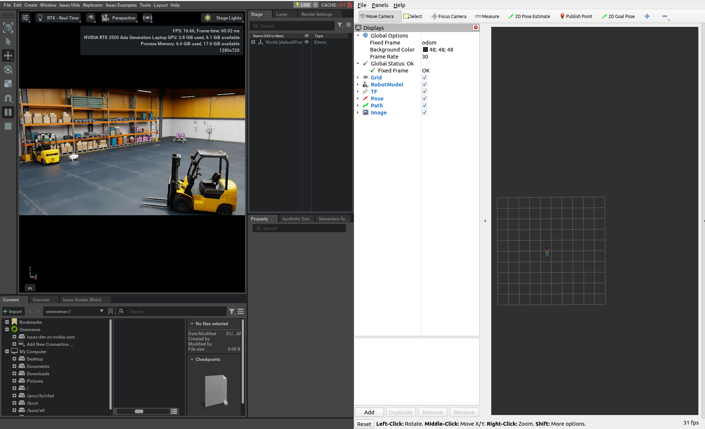
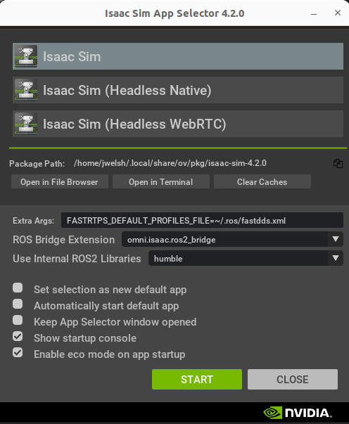
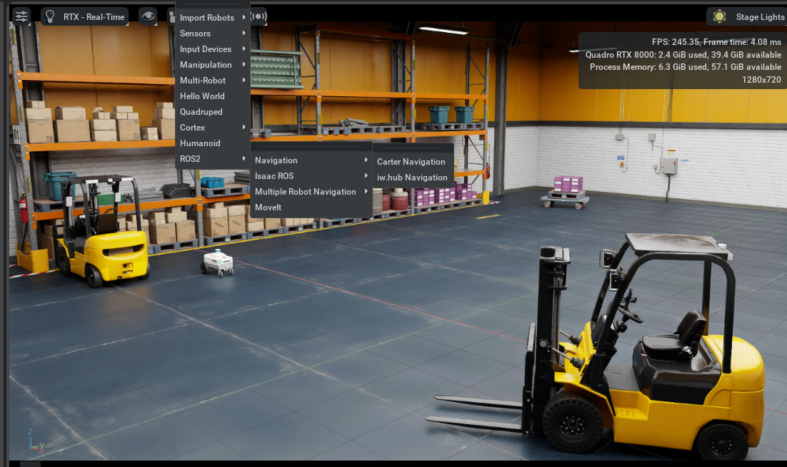

# X-Mobility - Isaac Sim + ROS2 Navigation Example

This example demonstrates how you can use the X-Mobility TensorRT engine
to run navigation inside Isaac Sim using the ROS2 bridge and the ``x_mobility_navigator`` ROS2 package.



## Prerequisites

- A Ubuntu 22.04 machine with recommended [Isaac Sim System Requirements](https://docs.omniverse.nvidia.com/isaacsim/latest/installation/requirements.html)

We will install Isaac Sim 4.2, ROS2 Humble, and NVIDIA TensorRT on your machine.  You may be able to skip some steps if these are already
provided.

## Instructions

### Step 1 - Install Isaac Sim 4.2

1. Follow the instructions [here](https://docs.omniverse.nvidia.com/isaacsim/latest/installation/install_workstation.html) to install Isaac Sim 4.2 on your workstation.

### Step 2 - Install ROS2 Humble

1. Follow the instructions [here](https://docs.ros.org/en/humble/Installation/Ubuntu-Install-Debs.html) to install ROS2 Humble from debian packages.
2. For convenience, add the text ``source /opt/ros/humble/setup.bash`` to the end of your ``~/.bashrc`` file.

### Step 3 - Install NVIDIA TensorRT

1. Install NVIDIA TensorRT following the guides [here](https://docs.nvidia.com/deeplearning/tensorrt/10.8.0/installing-tensorrt/installing.html#).
2. Test the installation by calling ``python3 -c "import tensorrt"``
3. Install PyCUDA 

    ```bash
    pip3 install pycuda
    ```

### Step 4 - Setup your ROS2 workspace and build x_mobility_navigator package

1. Create the ros2 workspace folder

    ```bash
    mkdir -p ~/ros2_ws/src
    ```

2. Create a symlink to the x_mobility_navigator ROS2 package in this repository.

    ```bash
    ln -s <repo root>/ros2_deployment/x_mobility_navigator ~/ros2_ws/src/x_mobility_navigator
    ```

3. Build the ROS2 workspace

    ```bash
    cd ~/ros2_ws
    ```

    and 

    ```bash
    colcon build --symlink-install
    ```

### Step 5 - Build the TensorRT engine

1. Export the ONNX file as detailed in the main [README](../README.md).
2. Build the TensorRT engine

    ```bash
    python3 trt_conversion.py -o <onnx_file_path> -t <trt_file_path>
    ```
3. Copy the TensorRT engine to ``/tmp/x_mobility.engine``.  The x_mobility_navigator launch file uses this path by default.

Now you have everything needed to run the ``x_mobility_navigator`` package.  

But we'll return to this step later, first we need to enable ROS2 with Isaac Sim.

### Step 6 - Enable ROS2 with Isaac Sim

1. Install the extra ROS2 message packages

    ```bash
    sudo apt install ros-humble-vision-msgs ros-humble-ackermann-msgs
    ```

2. Create a file named ``~/.ros/fastdds.xml`` and add the following file contents

    ```xml
    <?xml version="1.0" encoding="UTF-8" ?>

    <license>Copyright (c) 2022-2024, NVIDIA CORPORATION.  All rights reserved.
    NVIDIA CORPORATION and its licensors retain all intellectual property
    and proprietary rights in and to this software, related documentation
    and any modifications thereto.  Any use, reproduction, disclosure or
    distribution of this software and related documentation without an express
    license agreement from NVIDIA CORPORATION is strictly prohibited.</license>

    <profiles xmlns="http://www.eprosima.com/XMLSchemas/fastRTPS_Profiles" >
        <transport_descriptors>
            <transport_descriptor>
                <transport_id>UdpTransport</transport_id>
                <type>UDPv4</type>
            </transport_descriptor>
        </transport_descriptors>

        <participant profile_name="udp_transport_profile" is_default_profile="true">
            <rtps>
                <userTransports>
                    <transport_id>UdpTransport</transport_id>
                </userTransports>
                <useBuiltinTransports>false</useBuiltinTransports>
            </rtps>
        </participant>
    </profiles>
    ```

3. Open the Omniverse Launcher.
4. Launch the Isaac Sim App Selector, and set the following parameters to enable ROS2 Bridge

    - Extra Args: ``FASTRTPS_DEFAULT_PROFILES_FILE=~/.ros/fastdds.xml``
    - ROS Bridge Extension: ``omni.isaac.ros2_bridge``
    - Use Internal ROS2 Libraries: ``humble``

    It should look like this:

    


### Step 7 - Run the Isaac Sim + ROS2 navigation example

1. Launch Isaac Sim (if not already running)
2. Launch the Carter Navigtion example by clicking ``Isaac Examples`` > ``ROS2`` > ``Navigation`` > ``Carter Navigation``

    

3. Click the ``Play`` icon on the left toolbar.

### Step 8 - Test the ROS2 Connection

1. Open a terminal
2. Source the ros2 setup (you can skip if it's in your ~/.bashrc)

    ```
    source /opt/ros/humble/setup.bash
    ```

3. List the available topics

    ```
    ros2 topic list
    ```

You should see the following topics

```bash
/back_stereo_imu/imu
/chassis/imu
/chassis/odom
/clock
/cmd_vel
/front_3d_lidar/lidar_points
/front_stereo_camera/left/camera_info
/front_stereo_camera/left/image_raw
/front_stereo_camera/left/image_raw/nitros_bridge
/front_stereo_imu/imu
/left_stereo_imu/imu
/parameter_events
/right_stereo_imu/imu
/rosout
/tf
```

Great, that means everything is running and we can interface with the simulated robot over ROS2.

### Step 9 - Launch X-Mobility

Now let's launch the X-Mobility package

1. Source the built workspace

    ```bash
    cd ~/ros2_ws
    ```

    and

    ```bash
    source install/setup.bash
    ```

2. Launch the X-Mobility navigator

    ```bash
    ros2 launch x_mobility_navigator x_mobility_navigator.launch.py
    ```

3. Set a goal pose: Select ``2D Goal Pose`` and then click on the map to set a position / orientation.

That's it!  If everything worked, you should see the robot moving towards the goal pose in the simulation.

